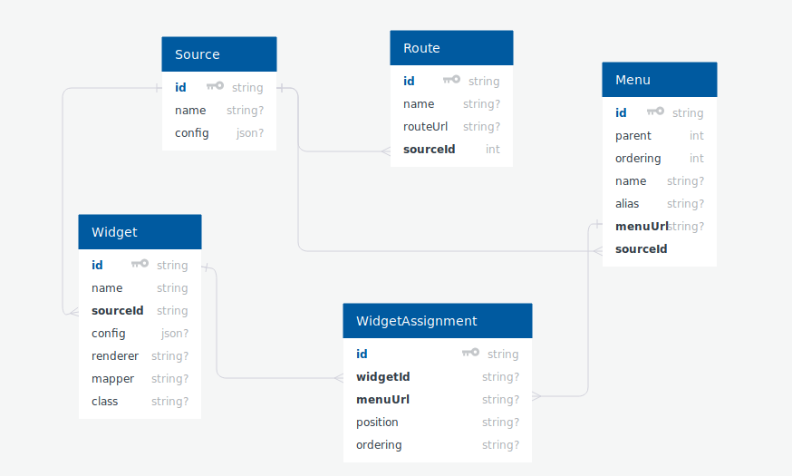

**Prerequisite for Unite**
 - Node, NPM, loopback-v3 (nodejs framework) and mongoDB should be installed on you system.
 

**Setup Unite on localhost**
 1. Clone this repo and goto the server folder and run *npm install* command it will download all the node dependencies and then run *node .* command to run the node server.
 
 2. After successfully run the server then run this *http://localhost:3002/explorer* URL in the browser and add your application data for (Menu, Widget, WidgetAssignment, Source) using post service from loopback. refer Database Design Diagram for more clarification on relations between collections.
 
 3. Next, goto the web folder and run *npm install* command after that run *ng serve --open* command and check your application run on *http://localhost:4200* .

 **Unite Documentation Link**
   https://docs.google.com/document/d/1cin9yFF5QIiw02xFJVsFWsmwnbd5cHSquZ-HUIuxzDQ/edit?usp=sharing

 **Database Design Diagram**
 1. link - <a href="https://app.quickdatabasediagrams.com/#/schema/kgDNgaLMYESb-suRwpJeGw" target="_blank">Database design</a>

    
